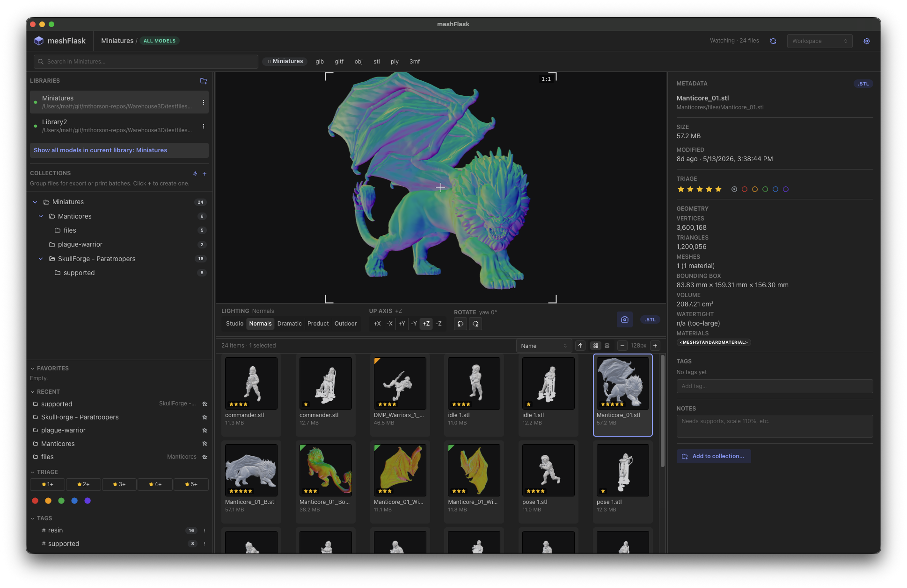

# meshFlask



A desktop browser and organizer for 3D model files. This project is
aimed specifically at the 3D printing community but will be enhanced for
3D artists as well.

Currently we target file formats common to 3D printing:
**glb, gltf, obj, stl, ply, 3mf**.

If your collection of STL, OBJ, and 3MF files is a dumpster fire that's
difficult to search through, this is for you.

## What's in it

Open one or more folders as "libraries". Each library gets its own SQLite
database (`.meshFlask.db` at the library root) tagged with a UUID; the
per-machine mount path lives in your user app data. Move the library
between machines and the app reconnects by UUID — you just edit one line
in `libraries.json`.

Once a library is attached you get:

- A virtualized thumbnail grid (scales gracefully to libraries with
  thousands of files) plus a dense list view
- Hierarchical tags. Tag something `characters/heroes/Aragorn` and it
  shows up under all three.
- 1–5 star ratings and 5 color labels. Keyboard shortcuts: `1`–`5` for
  stars, `Cmd+1`..`Cmd+5` for color labels, `Cmd+0` to clear.
- Free-text notes per file with debounced auto-save
- Manual collections, plus smart collections (saved filter queries)
- Per-file orientation override (the STLs that come out sideways stay
  fixed across sessions)
- An interactive 3D preview with five lighting presets, four render
  quality tiers, and a "capture current view as thumbnail" button that
  also remembers the camera angle so the file reopens at the same shot
- Search across filename + tags + parsed metadata (SQLite FTS5)
- Fullscreen preview (`Space`), 2-up compare with synced cameras, batch
  rename, ZIP and PDF contact-sheet export of a collection
- Drag a file onto a folder to move it, `Cmd+D` to duplicate, `Delete`
  to send to trash (with a confirm dialog)
- Print-bed-fit check. Register your printer's bed in preferences and
  oversized models get a red **OVERSIZE** badge on their tile.
- Watertight check during thumbnail render; non-manifold meshes get a
  yellow **LEAKY** badge.
- External-app launcher with CLI template support (`{file}`, `{profile}`)
  so a slicer can be invoked with a specific profile from the right-click
  menu.

Built with Electron, runs on macOS, Windows, and Linux. See
[Packaging a release](#packaging-a-release) for the installer scripts.

## Running it locally

```sh
npm install
npm run dev
```

`npm install` automatically rebuilds `better-sqlite3` against Electron's
Node ABI (via the `postinstall` script). That's good for running the app
and bad for the test suite, because vitest runs in system Node. If you
want to run tests, use:

```sh
npm run test:full
```

which rebuilds `better-sqlite3` for system Node, runs vitest, then
rebuilds back for Electron. Slow but reliable. Plain `npm test` will
fail with an ABI mismatch error if you haven't manually rebuilt first.

`npm run typecheck` and `npm run build` don't touch the native module and
are always safe.

### Packaging a release

```sh
npm run dist            # builds for the current platform
npm run dist:mac        # macOS DMG + zip, arm64 + x64
npm run dist:win        # Windows NSIS installer, x64 (cross-builds from Mac)
npm run dist:linux      # Linux AppImage, x64
```

Output lands in `release/`. Binaries are **unsigned** — macOS Gatekeeper
will block the DMG on first open until you right-click → Open, and Windows
SmartScreen will warn users. Code signing requires Apple Developer + an
Authenticode cert respectively; both are outside what this repo sets up.

The app icon is generated from `build/icon.svg` (matches the in-app logo).
`npm run build:icon` re-renders the PNG at 1024×1024 via `sharp`;
electron-builder converts that into the platform-specific `.icns` / `.ico`
at packaging time.

### Sandbox shells

Some environments (CI runners, certain sandboxed terminals) set
`ELECTRON_RUN_AS_NODE=1`. If that's in your env, Electron refuses to
launch as a GUI and the dev server dies with a `Cannot read properties of
undefined (reading 'isPackaged')` error. Unset it:

```sh
unset ELECTRON_RUN_AS_NODE
npm run dev
```

## Adding a library

Click the **+** in the sidebar, pick a folder. The app writes
`<folder>/.meshFlask.db` and records the folder's mount path in your
user app data:

- macOS: `~/Library/Application Support/meshFlask/`
- Windows: `%APPDATA%/meshFlask/`

Two files live there:

- `libraries.json` is a UUID → mount-path map. If you move a library
  to a different machine, edit this file. The app matches by UUID
  and reconnects.
- `preferences.json` holds your global settings — units, registered
  print beds, external apps, NAS poll interval, render quality, slicer
  profiles. Managed through the gear-icon preferences modal in the
  header.

Quit and relaunch reopens every library you had attached. Libraries
remember per-machine UI state (favorites, recent folders, view
preferences) via `localStorage` keyed on the library UUID.

## Architecture

Three Electron processes:

1. **Main** — owns the SQLite connection (`better-sqlite3`), the
   filesystem watcher (`chokidar` plus an initial walker), the
   thumbnail worker pool, and external-app launching. All IPC handlers
   register here.
2. **Renderer** — the visible UI. React + Mantine, with a Three.js
   viewer for the live preview. Talks to main via a typed contextBridge
   defined in `src/preload/preload.ts`.
3. **Thumbnail workers** — a small pool of hidden off-screen
   `BrowserWindow`s, each rendering one model at a time to a PNG. Pool
   recycles workers after a fixed job count to bound GPU/VRAM leaks.
   These have `nodeIntegration: true` so they can read files directly.

The renderer uses two custom Electron protocols: `wh3d-thumb://` for
tile images and `wh3d-file://` for raw model bytes. Both URL shapes are
`<library-uuid>/<file-id>`. Registered as privileged so they work
under the strict CSP the renderer ships with.

### Paths and portability

The single source of truth for OS paths is `src/shared/paths.ts`. The
per-library DB stores POSIX-relative paths only. The per-machine mount
path is in `libraries.json`. This is the whole reason a library on a
NAS works the same whether you mounted it at `/Volumes/nas/3d` on macOS
or `Z:\3d` on Windows.

If you reach for `path.join` outside `PathResolver`, you're about to
break NAS portability. Don't.

### SQLite

Two non-default quirks:

- `journal_mode = TRUNCATE` on libraries that live on NAS mounts. WAL
  is unsafe over NFS/SMB. The `looksLikeNetworkMount` heuristic picks
  the journal mode at attach time.
- Schema versioning via SQLite's `user_version` pragma. Migrations are
  numbered `.sql` files under `src/main/db/migrations/` and applied on
  first open. Current schema: v10.

### Thumbnail storage

WebP sidecars at
`<library_root>/.meshFlask/thumbs/<aa>/<bb>/<file_id>.webp` (two-level
hash fanout — a million-file library doesn't end up with a million
files in one directory). They're not stored as SQLite BLOBs because
that balloons the DB file and makes backups annoying.

## Known rough edges

- **Bambu Studio multi-part 3MFs above ~30 MB of mesh data** fall back
  to the slicer's embedded preview PNG instead of rendering live in the
  viewer. The stock Three.js `ThreeMFLoader` doesn't follow the
  production-extension `p:path` references between zip parts; we work
  around it for small files by reordering the zip entries before
  handing them to the loader, but the 136 MB `manticore.3mf` test
  fixture goes straight to the PNG fallback. Tile thumbnails still
  render fine because they use the embedded PNG anyway.
- **Background thumbnail rendering is pinned to "Low" quality**
  regardless of the render-quality preference. Capturing a thumbnail
  manually from the preview pane uses the current quality setting;
  batch rendering does not. If you bump quality from Low → High and
  want the existing thumb cache to match, you'd have to manually
  rebuild it from preferences → cache.
- **Packaged builds are unsigned.** `npm run dist` produces working
  installers, but macOS Gatekeeper and Windows SmartScreen will warn
  users on first launch. Adding code-signing certs is left as an
  exercise for whoever wants to ship this publicly.
- **No cross-library view.** Each query is scoped to one library at a
  time. (There was a brief experiment with an "All Libraries" mode; it
  turned out to be a tangle of edge cases per-library tags and
  collections didn't handle cleanly, and got removed.)

## Layout

```text
src/
  main/              Electron main process
    db/              better-sqlite3 wrapper, migrations, repos
    libraries/       Open/close/rename/remove libraries; the registry
    scanner/         Initial walker + chokidar watcher
    thumb-pool/      Hidden BrowserWindow pool + queue runner
    preferences/     preferences.json read/write
    cache/           Thumbnail cache rebuild + purge
    ipc/             Typed IPC handlers
    protocol/        wh3d-thumb:// + wh3d-file:// handlers
  renderer/          React UI + Three.js viewer
    components/      Sidebars, modals, panels, widgets
    three/           ModelViewer, lighting rig, loaders, validation
    util/            usePreferences hook, formatters
  preload/           contextBridge → typed IpcApi
  shared/            Pure modules used by every process: paths, types,
                     sort, ratings, smart-query, rename-template, units,
                     print-bed, render-quality, lighting-types, ...
```

## Tests

```sh
npm run test:full
```

Coverage is deliberately patchy: path resolution, the SQLite query
layer, folder-tree construction, FTS triggers, rename detection,
smart-collection query validation, ratings, orientation, batch-rename
template parsing, 3MF fast-path probing. Anything involving Three.js,
Electron windows, or the live filesystem walker against a real fixture
gets exercised through running the app, not vitest.
